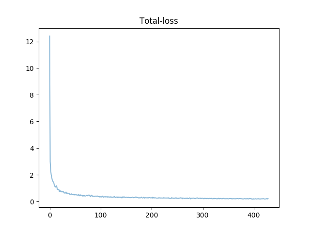
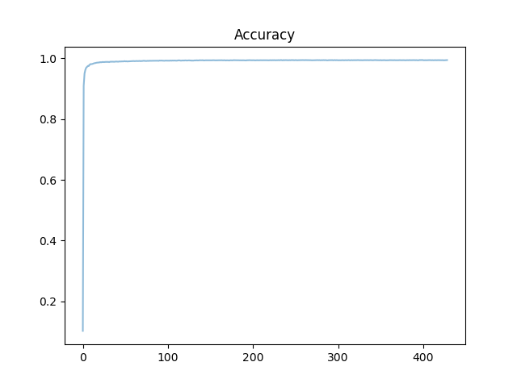
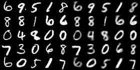
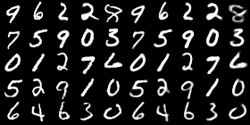
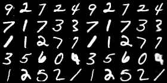

# Capsule-Network
Try out CapsNet

# Reference
* Based on https://github.com/naturomics/CapsNet-Tensorflow

# Losses

# Accuracy

# Reconstruction Results
| Epochs | Original - Reconstruction |
| :----: | :-----------------------: |
| 1 |  | 
| 25 |  |
| 50 |  |
